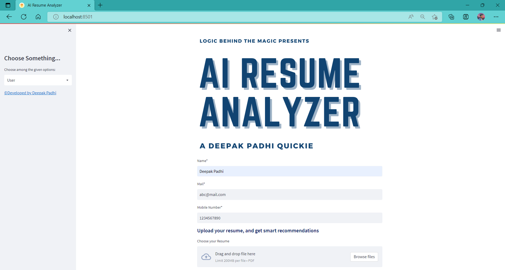
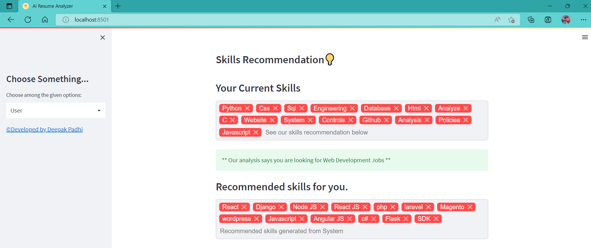
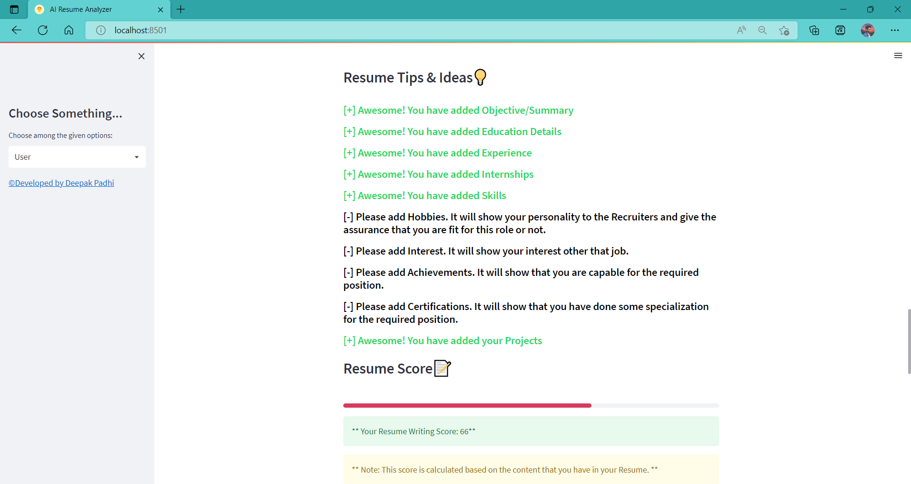
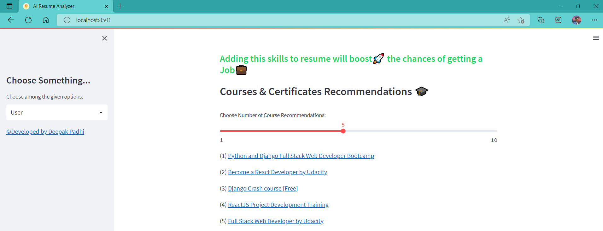
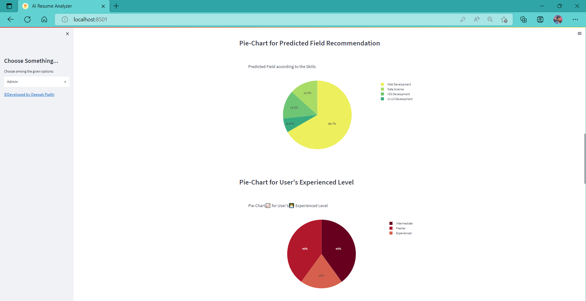
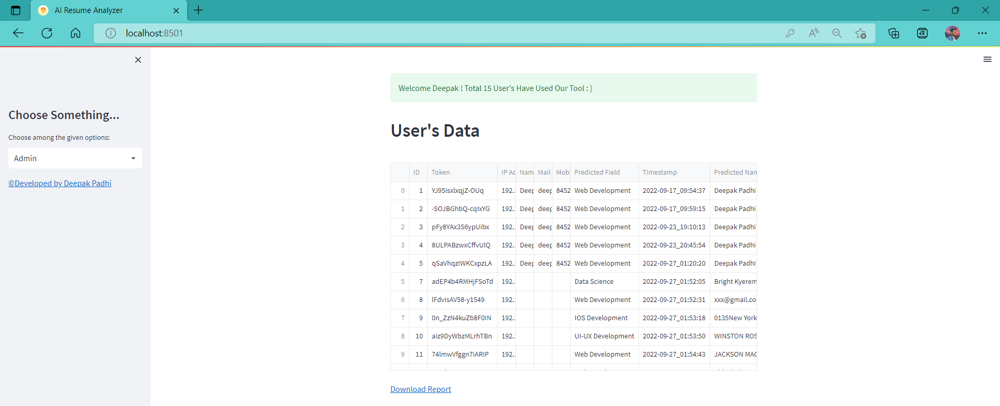

<div align="center">

# ✨ Skill-Forge : AI Resume Analyzer 🚀

<a href="https://github.com/Bala-Ganesh-444/Skill-Forge---Ai-Resume-Analyzer">
  
</a>

<br><br>

[](https://www.python.org/)
[](https://streamlit.io/)
[](https://www.mysql.com/)
[](https://github.com/Bala-Ganesh-444/Skill-Forge---Ai-Resume-Analyzer)
[](LICENSE)

**A complete Natural Language Processing (NLP) ecosystem to help job seekers match their resumes perfectly to industry standards.**

</div>

<br>

<div align="center">

## 🍱 Project Overview
*Explore our feature-rich modern tech stack in a glance!*

<table width="100%">
  <tr>
    <td width="33%" valign="top" align="center">
      <h3>🎯 Core Objective</h3>
      <p align="left">Parses unstructured resumes to extract keywords, structure the data into JSON, and cluster user profiles based on skillsets.</p>
    </td>
    <td width="33%" valign="top" align="center">
      <h3>🧠 NLP Powered</h3>
      <p align="left">Utilizes advanced NLP to find exact skill matches, gaps, and keyword misalignments to boost job interview chances.</p>
    </td>
    <td width="34%" valign="top" align="center">
      <h3>📈 Insightful Dashboard</h3>
      <p align="left">Admin dashboard for HRs/colleges to visualize candidate demographics, score distributions, and domain predictions via interactive charts.</p>
    </td>
  </tr>
</table>

### 🚀 High-Tech Arsenal
<table>
  <tr>
    <td align="center"><b>Frontend</b></td>
    <td align="center">Streamlit, HTML5, CSS3, Vanilla JS</td>
  </tr>
  <tr>
    <td align="center"><b>Backend & Parsing</b></td>
    <td align="center">Python, spaCy, NLTK, pyresparser, pdfminer3</td>
  </tr>
  <tr>
    <td align="center"><b>Data & Database</b></td>
    <td align="center">MySQL, pandas, Plotly</td>
  </tr>
</table>

</div>

---

<div align="center">

## 🖼️ Interactive UI Preview Showcase

<table width="100%">
  <tr>
    <th colspan="2"><h3>🧑‍💻 For the Candidate (Client View)</h3></th>
  </tr>
  <tr>
    <td width="50%" align="center">
      <b>Client Workspace 🧰</b><br><br>
      
    </td>
    <td width="50%" align="center">
      <b>Smart Skill Recommendations 🧠</b><br><br>
      
    </td>
  </tr>
  <tr>
    <td width="50%" align="center">
      <b>Actionable Resume Tips & Score 🏆</b><br><br>
      
    </td>
     <td width="50%" align="center">
      <b>Course Recommendations 📚</b><br><br>
      
    </td>
  </tr>
  
  <tr>
    <th colspan="2"><h3>👑 For the HR / Recruiter (Admin View)</h3></th>
  </tr>
  <tr>
    <td width="50%" align="center">
      <b>Admin Analytics Dashboard 📊</b><br><br>
      
    </td>
    <td width="50%" align="center">
      <b>Data Management Export 📉</b><br><br>
      
    </td>
  </tr>
</table>

> *Note: Admin UI default credentials are: **Username:** `admin` | **Password:** `admin@resume-analyzer`*

</div>

---

## ⚡ Quick Start & Installation Guide

To run this project locally, follow these simple steps:

### 1️⃣ Prepare Environment
Ensure you have the following installed:
- [Python 3.9.12](https://www.python.org/downloads/release/python-3912/)
- [MySQL Database](https://www.mysql.com/downloads/)
- [Visual Studio Build Tools for C++](https://aka.ms/vs/17/release/vs_BuildTools.exe)

### 2️⃣ Clone & Setup Virtual Env
```bash
git clone https://github.com/Bala-Ganesh-444/Skill-Forge---Ai-Resume-Analyzer.git
cd Skill-Forge---Ai-Resume-Analyzer

# Create virtual environment (Highly Recommended)
python -m venv venvapp

# Windows Activation
.\venvapp\Scripts\activate
# Mac/Linux Activation (If applicable)
# source venvapp/bin/activate
```

### 3️⃣ Install Dependencies
```bash
cd App
pip install -r requirements.txt

# Download required spaCy models
python -m spacy download en_core_web_sm
```

### 4️⃣ Database Configuration & Fixes
- **Create DB:** Create a database named `cv` in your MySQL Server.
- **Configure Credentials:** Open `App/App.py` and modify line 95 to include your MySQL credentials (hostname, user, password).
- **Patch pyresparser:** Go to `venvapp/Lib/site-packages/pyresparser/` and replace `resume_parser.py` with the one provided in the repository's `./pyresparser/` folder.

### 5️⃣ Ignite the App! 🔥
Return to the `App` directory and run:
```bash
streamlit run App.py
```
> **Known Error:** If `GeocoderUnavailable` comes up, just check your internet connection/network speed.

---

## 🗺️ Future Roadmap

- [x] Predict user experience level dynamically.
- [x] Add dynamic resume scoring criteria for skills and projects.
- [x] Incorporate fields/recommendations for Web, Android, Data Science, and iOS.
- [ ] Incorporate LLMs/GenAI (OpenAI, Gemini) for context-aware resume feedback.
- [ ] Expand recommendations for Non-Tech domains (Sales, Marketing, HR).
- [ ] View individual detailed user profile sheets.

---

## 🤝 Contribution Guidelines

Got ideas? We'd love your contributions! 
1. Fork the repository
2. Create your feature branch (`git checkout -b feature/AmazingFeature`)
3. Commit your changes (`git commit -m 'Add some AmazingFeature'`)
4. Push to the branch (`git push origin feature/AmazingFeature`)
5. Open a Pull Request!

---

<p align="center">
  <br><b>Built with 🤍 by AI Engineers & Data Scientists</b><br>
  <i>A tool dedicated to making hiring and applying seamless and fair.</i>
</p>
